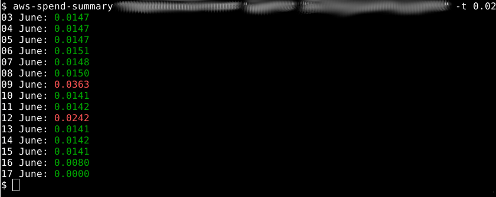

# AWS Spend Summary Tool

[](https://repology.org/project/aws-spend-summary/versions)

A command-line tool that displays your recent daily AWS cost usage without needing to log into the AWS console. This tool reads from AWS Cost and Usage Reports stored in S3, which is significantly more cost-effective than using the AWS Cost Explorer API.




## Features

- 📊 View daily AWS spending from the command line
- 💰 Set spending thresholds to highlight high-cost days
- 📄 Export data to CSV for further analysis and reporting
- 🔄 Automatically merges data from multiple S3 report files
- 🚀 Fast and cost-effective (uses S3-stored reports instead of expensive APIs)
- 🔐 Secure authentication using AWS credentials

## Prerequisites

- AWS CLI installed and configured
- An AWS Cost and Usage Report configured in your AWS account
- Appropriate IAM permissions

## Installation

```bash
# Install via Nix
nix-env -iA nixpkgs.aws-spend-summary

# Or run directly without installing
nix run nixpkgs#aws-spend-summary
```

## Quick Start

```bash
aws-spend-summary my-cost-reports reports/monthly my-cost-report --threshold 2.00
```

## Setup Guide

### 1. Create AWS Cost and Usage Report

Before using this tool, you need to set up a Cost and Usage Report in AWS:

1. **Navigate to AWS Billing Console**
   - Go to the [AWS Billing and Cost Management Console](https://console.aws.amazon.com/billing/)
   - Click on "Cost & Usage Reports" in the left sidebar

2. **Create a New Report**
   - Click "Create report"
   - Enter a report name (e.g., `daily-cost-report`)
   - Check "Include resource IDs" if you want detailed resource information
   - Select "Hourly" or "Daily" granularity (Daily recommended for this tool)

3. **Configure S3 Delivery**
   - Choose an existing S3 bucket or create a new one
   - Enter an S3 prefix (path) for organizing reports (e.g., `cost-reports/`)
   - Select "CSV" as the format
   - Choose "GZIP" compression
   - Enable "Overwrite existing report" for the most recent data

4. **Finalize Settings**
   - Review your settings and click "Next"
   - Click "Review and Complete"

**Note**: It can take up to 24 hours for your first report to be generated.

### 2. Configure AWS Credentials

Set up your AWS credentials using the AWS CLI:

```bash
# Configure credentials (AWS CLI should be available through your system package manager)
aws configure
```

This creates:
- `~/.aws/credentials` - Contains your access keys
- `~/.aws/config` - Contains account configuration

### 3. Set Up IAM Permissions

Create an IAM policy with the following permissions for secure access:

```json
{
    "Version": "2012-10-17",
    "Statement": [
        {
            "Sid": "CostExplorerAccess",
            "Effect": "Allow",
            "Action": [
                "ce:GetCostAndUsage",
                "ce:GetPreferences",
                "ce:GetDimensionValues",
                "ce:GetCostCategories",
                "ce:GetUsageForecast",
                "ce:GetCostForecast",
                "ce:GetTags",
                "ce:ListCostCategoryDefinitions"
            ],
            "Resource": "*"
        },
        {
            "Sid": "S3CostReportAccess",
            "Effect": "Allow",
            "Action": [
                "s3:GetObject",
                "s3:ListBucket"
            ],
            "Resource": [
                "arn:aws:s3:::your-cost-report-bucket",
                "arn:aws:s3:::your-cost-report-bucket/*"
            ]
        }
    ]
}
```

**Important**: Replace `your-cost-report-bucket` with your actual S3 bucket name.

## Usage

### Basic Usage

```bash
aws-spend-summary BUCKET_NAME BUCKET_PATH COST_REPORT_NAME
```

### With Spending Threshold

```bash
aws-spend-summary my-costs reports/daily cost-analysis --threshold 5.00
```

### Command Line Options

| Argument/Option | Description | Required |
|-----------------|-------------|----------|
| `BUCKET_NAME` | S3 bucket containing cost reports | Yes |
| `BUCKET_PATH` | S3 path/prefix to the reports | Yes |
| `COST_REPORT_NAME` | Name of the cost report | Yes |
| `-d, --days` | Number of days to show (default: 15) | No |
| `-t, --threshold` | Threshold for red/green coloring (default: 1.0) | No |
| `--csv-output` | Output file for CSV export | No |

## Examples

### Monitor Daily Spend
```bash
aws-spend-summary company-billing cost-reports daily-usage --threshold 10.00
```

### Check Last 7 Days Only
```bash
aws-spend-summary my-costs monthly-reports main-report --days 7
```

### Export to CSV for Analysis

```bash
aws-spend-summary my-costs reports/daily cost-analysis --csv-output monthly-spend.csv
```

### Run with Nix (without installing)
```bash
nix run nixpkgs#aws-spend-summary -- my-costs reports/daily cost-analysis --threshold 5.00
```

## Troubleshooting

### Common Issues


**"Unable to read access key from AWS_ACCESS_KEY_ID (or AWS_ACCESS_KEY"**
- Check that you have configured AWS credentials following the instructions above

**"Got 404 when trying to retrieve results..."**
- S3 Bucket name may be incorrect
- Bucket path may be incorrect
- Cost report name may be incorrect

**"Access Denied to bucket"**
- Check your IAM permissions include both Cost Explorer and S3 access
- Verify the S3 bucket policy allows your IAM user/role to read objects
- Verify that the bucket name was typed correctly

### Getting Help

If you encounter issues:
1. Check the [GitHub Issues](https://github.com/your-repo/awsspendsummary/issues)
2. Verify your AWS Cost and Usage Report configuration
3. Ensure your IAM permissions are correctly set up

## Why This Approach?

Using Cost and Usage Reports stored in S3 instead of the Cost Explorer API provides several advantages:

- **Cost-effective**: S3 storage costs are minimal compared to API calls
- **Faster**: Direct S3 access is quicker than API requests
- **Reliable**: No API rate limits or throttling
- **Detailed**: Access to raw usage data
- **Data consolidation**: Automatically merges multiple report files from S3, saving you from manually downloading and combining CSV files
- **Analysis-ready**: CSV export makes it easy to import into Excel, Google Sheets, or data analysis tools

## 💰 Why Use This Instead of Cost Explorer API?

### 💰 Real-World Cost Savings

Monitoring your AWS costs shouldn't cost more than your actual AWS usage! Here's what you roughly save (depends on the region and prices might change):

| Monitoring Pattern | Cost Explorer API | aws-spend-summary | You Save |
|-------------------|-------------------|-------------------|----------|
| Once daily | $0.30/month | < $0.01/month | 97% |
| Hourly (business hours) | $1.76/month | < $0.08/month | 95% |
| Every 30 min (business) | $3.52/month | < $0.15/month | 96% |
| Every hour (24/7) | $5.28/month | < $0.22/month | 96% |

For a developer checking costs hourly during work hours, that's **$20+ saved per year** - enough for a nice dinner or a few months of a streaming subscription!

### Additional Benefits
- ✅ **No API rate limits** - Check as often as you want
- ✅ **More detailed data** - Access individual line items
- ✅ **Bulk operations** - Analyze multiple days without multiple API calls

### Perfect For
- 🎓 Students learning AWS
- 👨‍💻 Developers with personal projects
- 🚀 Bootstrapped startups watching every penny
- 🧪 Anyone using AWS free tier who wants to stay within limits

## Contributing

Contributions are welcome! Please feel free to submit pull requests or open issues.

[](https://repology.org/project/haskell%3Aaws-spend-summary/versions)


## License

This project is licensed under the GNU General Public License v2.0 - see the LICENSE file for details.

